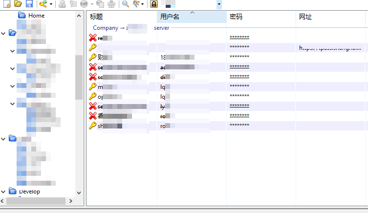

# 基础

一标准开发规范，可以让所有人都看得懂代码。高效协作。在软件开发中，不管各种开发语言，都需要遵守下面的开发规范。

采用专用IDE可以发,代码编写不规范的时候会提醒。如 idea 的代码分析功能，可以提示代码优化。

## 驼峰命名和下划线命名

```
驼峰命名：驼峰命名是指，单词的首字母大写，其他字母小写，如：UserName
下划线命名：下划线命名是指，单词的首字母小写，其他字母大写，如：user_name
```

由于在早期的windows(win8以下)系统的文件名和文件夹名不区分大小写，所以在代码中，使用驼峰命名，在文件名，文件夹名中，使用下划线命名。


变量只能使用英文单词组合,不可使用拼音。多个单词使用驼峰命名，或者下划线组合，如：HelloWorld，或者hello_world。具体根据不同语言的风格进行规范使用。

## 常用开发软件

windows 11

* [iTerm2](software/mac/softwares/iTerm2.md)
* [brew](software/mac/softwares/brew.md)
* [zsh](software/mac/softwares/zsh.md)
* [1Password](software/mac/softwares/1Password.md)
* [TextExpander](software/mac/softwares/TextExpander.md)
* [欧陆词典](software/mac/softwares/euDic.md)
* [popClip](software/mac/softwares/popClip.md)
* [manico](software/mac/softwares/manico.md)
* [窗口管理器](software/mac/softwares/window-management.md)
* [BetterTouchTool](software/mac/softwares/bettertouchtool.md)

mac

linux：

## 快捷键


## 服务器

服务器最小权限配置，采用key方式ssh登录。

密码采用 keepass 生成与保存。



## 开源协议

创建项目的时候，可以默认使用 apache2.0 协议。设计稿使用adobe 协议。商业项目可以使用BSD协议。


